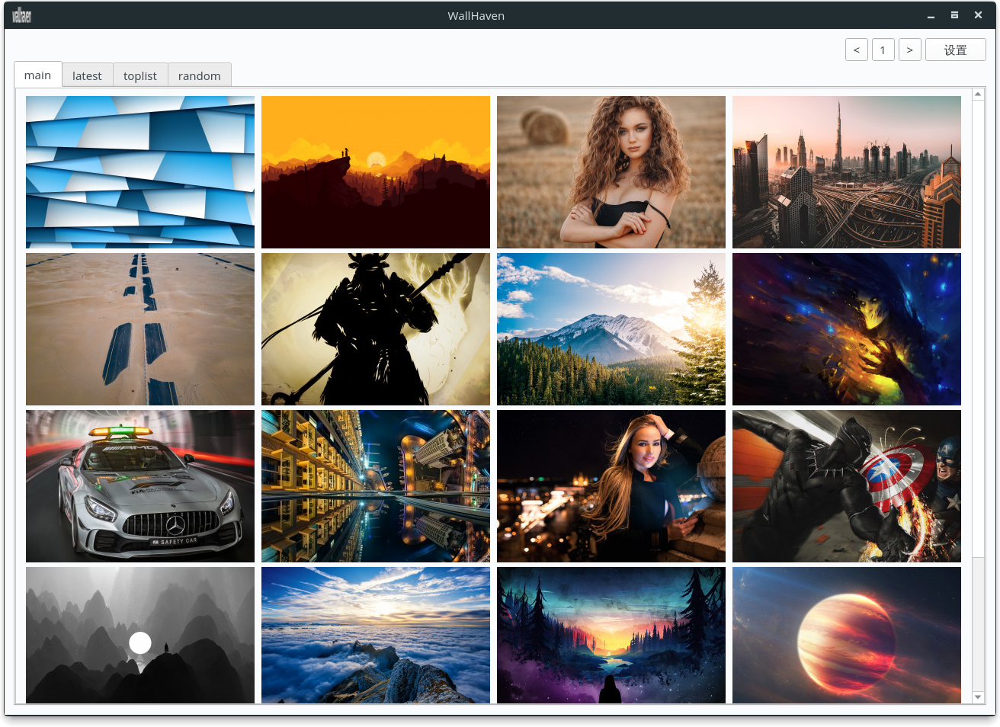

# 基于wallhaven.cc的壁纸程序
仅供学习

## 目前功能
* 简易的预览界面
* 简易的大图预览
* 简易的设置界面
* 糟糕的内存缓存
* 单纯的下载功能

## 开发计划

* 更好的缓存技术
* 使用更多线程下载预览图片
* 大图预览界面大改
* 跨平台
* 跨平台的一键壁纸设置
* 界面美化

## 第三方库
* [requests](http://www.python-requests.org/en/master/)
* [PyQt5](https://riverbankcomputing.com/software/pyqt/intro)

